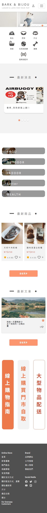
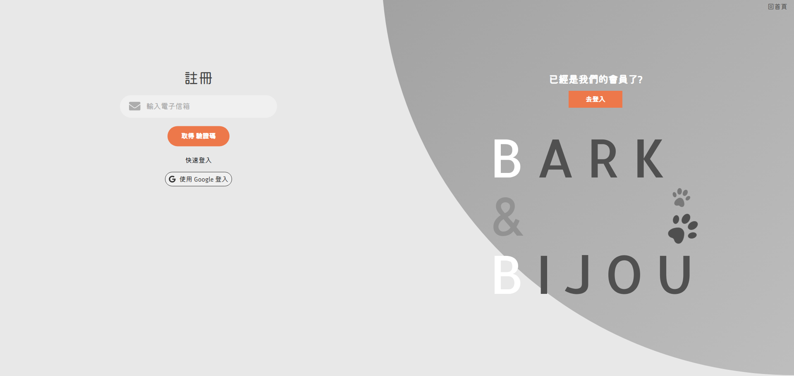
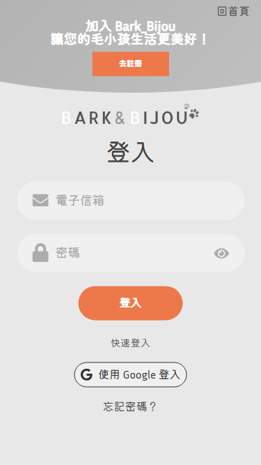
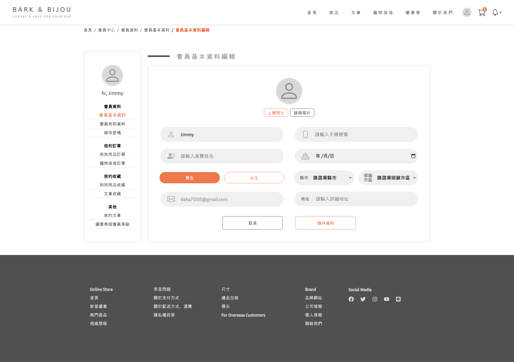
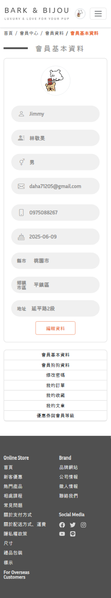
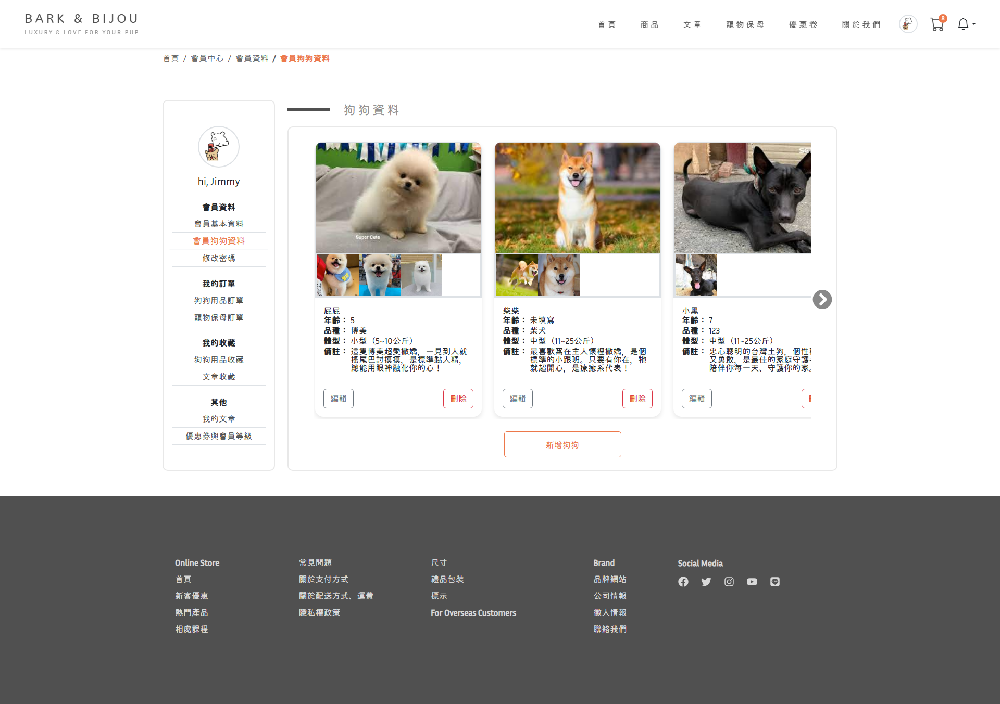
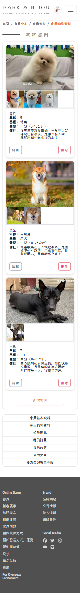

# 寵物用品購物平台網站-Tutor

## 專案簡介:

- BARK & BIJOU 是一個專為狗狗與飼主打造的 寵物用品購物平台，結合 電商購物、寵物保母服務、文章分享與活動資訊，提供飼主一站式的寵物生活解決方案。

- 使用者可以透過 會員註冊或第三方登入（Google） 進入平台，並享有以下功能：

1. 在商城中瀏覽、收藏與購買各式狗狗用品
2. 預約狗狗保母服務，並查看保母的專業資訊與評價
3. 收藏文章與活動，打造個人化的寵物知識與娛樂清單
4. 進入會員中心編輯個人資料、管理收藏與訂單

本專案以前後端分離的架構開發，前端使用 Next.js 建構響應式網站，後端使用 Express.js 提供 API 服務，並以 MySQL + Prisma 管理資料庫。。










- 專案企劃書:
  

- front-End: [https://github.com/LinJimmy1219/next.git](hhttps://github.com/LinJimmy1219/next.git)
- Back-End: [https://github.com/LinJimmy1219/express.git](https://github.com/LinJimmy1219/express.git)

## 使用技術：

### 前端 (Next.js)

1. Next.js：建構 SSR/CSR 混合的 React 應用
2. React Context：全域狀態管理（登入狀態、購物車）
3. Bootstrap：UI 快速開發 + 自訂化樣式
4. SweetAlert2：快速做出客製化彈出式提示視窗

### 後端 (Express.js)

1. JWT 驗證：會員登入、權限管理
2. Multer：圖片上傳（頭像、商品圖片）
3. bcrypt：密碼加密
4. express-validator：表單驗證
5. 第三方登入：Google快速登入
6. OTP / Email 驗證：Email 驗證碼機制

### 資料庫

1. MySQL：會員、商品、訂單、收藏、文章、活動等資料
2. Prisma：資料庫操作

## 安裝與下載 :

### 下載檔案至本地資料夾

```
git clone https://github.com/LinJimmy1219/next.git
```

### 開啟專案資料夾後安裝檔案

```
npm install
```

### 輸入執行碼

```
npm run dev
```

### 於瀏覽器輸入以下網址

```
http://localhost:3000/
```
